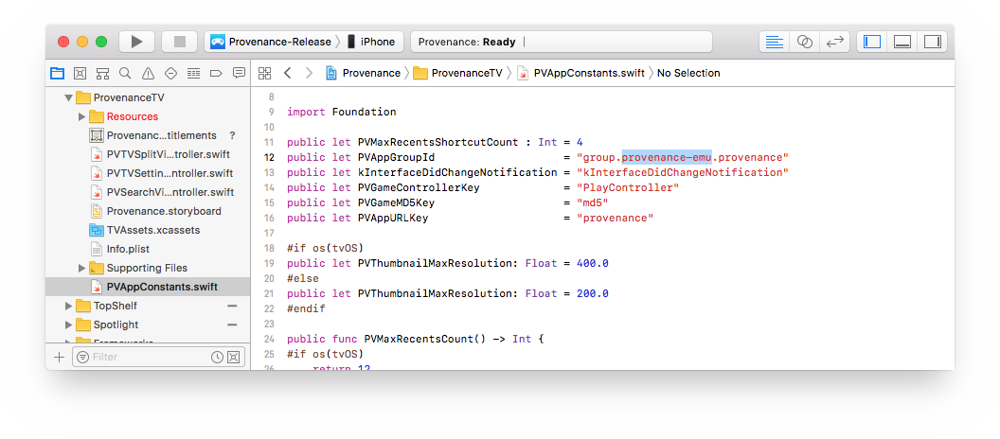

# Building from Source

To get the very latest in-development build, you will need to build from source with Xcode. There are no shortcuts. Provenance is a large project with required dependencies and submodules that help enable efficient development. Check that you meet the requirements. Follow each and every step. Make no assumptions. **Do not** skip _anything._

1. \*\*\*\*[**Get Source**](building-from-source.md#get-source)\*\*\*\*
2. \*\*\*\*[**Setup**](building-from-source.md#setup) \(install requirements and dependencies\)
3. \*\*\*\*[**Build Source**](building-from-source.md#build-source) to device \(Xcode\)
4. _\(Optional\)_ [**Enable Advanced Features**](building-from-source.md#advanced-features)\*\*\*\*


The beta is in active-development.



DO NOT expect to use a beta without issues, losing your saves, or bugs.



**Requirements**

* macOS 10.13.6+ 
  * on a Mac, Hackintosh or virtual machine \([Virtualizing macOS](https://wiki.provenance-emu.com/info/miscellaneous/virtualizing-macos)\)
* [Xcode](https://itunes.apple.com/us/app/xcode/id497799835) 10.2+
* iOS 10+ a/o tvOS 10+ SDKs
* _Free_ [Apple Developer](https://9to5mac.com/2016/03/27/how-to-create-free-apple-developer-account-sideload-apps/) account \(at a minimum\) or a _paid_ account.  


  🛑 **DO NOT** enroll to join the full Developer Program or you will be locked into a _Pending_ payment state, unable to code-sign unless you pay or contact Apple to cancel the enrollment.  

* Connections:
  * iPhone / iPad:    `Lightning` → `USB-A / USB-C` cable¹
  * Apple TV 4:      `USB-C` → `USB-A / USB-C` cable¹
  * Apple TV 4K:     `WiFi`²  \([Instructions](http://www.redmondpie.com/how-to-wirelessly-connect-apple-tv-4k-to-xcode-on-mac/)\)³

¹ Depends on which [ports](https://support.apple.com/en-us/HT201736) you have. _WiFi can be setup after._  
² USB ports have been discontinued on Apple TV 4K+.  
³ If using a virtual machine, you may need to [configure your network settings](../../info/miscellaneous/virtualizing-macos.md#cannot-detect-apple-tv-4k-over-wifi).


💢 If you get stuck, check out [Troubleshooting](building-from-source.md#troubleshooting).

## Get Source

**Source Options**

* 🔃  [**Clone**](building-from-source.md#clone) using…
  *   [Terminal](building-from-source.md#terminal)
  *   [Tower](building-from-source.md#tower)

#### Clone

Cloning is how you pull the source code from GitHub. The primary way to do this is using Terminal; However, if you're a developer or familiar with powerful git clients like Tower, this is also an option as long as you enable for initializing submodules.

#### **Terminal**


The Terminal app can be found in: _/Applications/Utilities_


1. Make sure you have the latest version of the Xcode command-line tools installed: `xcode-select --install`
2. _\(Optional\)_ Choose an install directory with `cd [path]` \(drag & drop a folder on Terminal after `cd`  to get directory path\).
3. Download source with…
   * HTTPS: `git clone --recurse-submodules -j4 https://github.com/Provenance-Emu/Provenance.git`
4. Continue to [Setup](building-from-source.md#setup)…


#### **Tower**

Tower is a powerful commercial git client that can automate a lot of the tasks you'd otherwise be using commandline for, such as stashing changes. It is however, _not free._

1. Purchase/Download [Tower](https://www.git-tower.com/mac/)
2. Launch Tower and Add Your Service Account: `GitHub`
3. _\(Optional\)_ In Menubar: Select `Tower` → `Preferences` \(or use `⌘,` shortcut\):
   * Set a 'default directory for clone repositories' such as `~Documents/GitHub`
4. In Menubar: Select `File` → `Clone Git Repository` \(or use `⌃⌘C` shortcut\):
   * Remote URL: `https://github.com/Provenance-Emu/Provenance.git`
   * ☑️ Initialize Submodules
5. Continue to [Setup](building-from-source.md#setup)…

~~**Download**~~

🚫 Due to the inclusion of submodules this method no longer works. **Do not** manually download source as `.zip`… 


If building from active develop branch, we _will not_ be held responsible for any loss of your game data! Install _**at your own risk!**_ …and back up your files.


## Setup

Using Terminal install the following requirements. If already set up, skip to [Build Source](building-from-source.md#build-source).


The Terminal app can be found in: _/Applications/Utilities_


#### Install Requirements

1. Install [Homebrew](https://brew.sh/) _\(if you don't have it\)_:

   ```bash
    /usr/bin/ruby -e "$(curl -fsSL https://raw.githubusercontent.com/Homebrew/install/master/install)"
   ```

2. Install [RVM](https://rvm.io/):

   ```bash
   \curl -sSL https://get.rvm.io | bash -s stable --ruby && source ~/.rvm/scripts/rvm
   ```

3. Navigate to the 'Provenance' directory with: `cd [path]` \(can drag & drop a folder on Terminal after `cd` to get directory path\) 
4. Install and build the relevant Submodules, Setup & Launch

   ```bash
    carthage bootstrap --platform IOS --no-use-binaries
    carthage bootstrap --platform tvOS --no-use-binaries
   ```

5. Continue to [Build Source…](building-from-source.md#build-source) 

💢 If you get stuck, check out [Troubleshooting](building-from-source.md#troubleshooting).

## Build Source

1. Open the Provenance Xcode workspace:  `Provenance.xcworkspace`

   ⚠️  **Do not** use the .xcodeproj file or you will have build errors!

    

2. Go to Preferences via Menubar: `Xcode` → `Preferences` or use `⌘,` shortcut.
   * Select Accounts tab.
   * Click `+`
   * Sign in with your personal or developer Apple ID. If you don't have one, click `Create Apple ID` or go to [appleid.apple.com](https://appleid.apple.com/).  


     ⚠️ At minimum, sign up as a _free_ [Apple Developer](https://9to5mac.com/2016/03/27/how-to-create-free-apple-developer-account-sideload-apps/) and do no more than agree to the terms.

     🛑 DO NOT enroll to join the full Developer Program or you will be locked into a _Pending_ payment state, unable to code-sign unless you pay or contact Apple to cancel the enrollment.  


     
3. In Project Settings, edit _all_ of the targets for your device:
   * iOS
     * **Provenance**
     * **Spotlight**
     * **ProvenanceShared**
     * **ProvenanceSharedTests**
   * tvOS
     * **ProvenanceTV**
     * **TopShelf**
     * **ProvenanceShared-tvOS**
   * Change the Bundle IDs for your target by replacing only `provenance-emu` with something unique to you \(like your username\), and use the same replacement for _all_ of your targets and _all_ subsequent updates.  


     🏍 You can install a duplicate app for testing by using a different bundle ID than your previous/main install.  
     

     ⚠️ .gif outdated, refer to text instructions.

* If using a free Apple Developer account, **Turn OFF** these Capabilities for _all_ targets:
  *   App Groups 
  *   iCloud
  *   Multipath
  *   Push Notifications
  *   Siri
* Turn ON ☑️**Automatically manage signing** and select your Development Team for your targets.

    

1. Select a `-Release` profile from the Scheme Menu and connect your device\(s\) and select in the Destination Menu:

    

      

2. If you are…
   * Paid Apple Developer: Continue to [Enable Advanced Features…](building-from-source.md#advanced-features)
   * Free Apple Developer: Hit the `▶︎` \(Run\) button.
3. Provenance will compile and run on your device. Unless testing, hit `◼︎` \(Stop\). _Done._

💢 If you get stuck, check out [Troubleshooting](building-from-source.md#troubleshooting).


Free Apple developer provisioning expires _every 7 days_, requiring reloading, but you will not lose any data.

_Paid_ Apple Developer provisioning may only require re-signing once a year.


## Advanced Features


**Requires** a _paid_ [Apple Developer](https://developer.apple.com/programs/) account.


1. If you haven't made one previously, add a new App Group ID: `group.[change-this].provenance` to your [Apple Developer](https://developer.apple.com/programs/) portal, or continue to next step and see if it allows you to add an App Group ID automatically when using `+` in App Groups.
2. \[Re-\]enable Capabilities on your target\(s\), with the following settings:

   * **iOS:**
     * Provenance:
       *   App Groups
         * 🔲 `group.provenance-emu.provenance`
         * ☑️ `group.[change-this].provenance`
       *   iCloud
       *   Multipath
       *   Push Notifications
       *   Siri 
     * Spotlight:
       *   App Groups
       *   iCloud
         * 🔘Specify custom containers:

                🔲 `iCloud.com.provenance-emu.provenance`

                ☑️ `iCloud.com.[change-this].provenance`
   * **tvOS:**
     * ProvenanceTV:
       *   App Groups
         * 🔲 `group.provenance-emu.provenance`
         * ☑️ `group.[change-this].provenance`
       *   iCloud
       *   Push Notifications 
     * TopShelf:
       *   App Groups

         * 🔲 `group.provenance-emu.provenance`
         * ☑️ `group.[change-this].provenance`

   

3. Define the value for `PVAppGroupId` in `PVAppConstants.swift` with your App Group ID.

   

4. Hit the `▶︎` \(Run\) button to build to your device.
5. Provenance will compile and run on your device. Unless testing, hit `◼︎` \(Stop\). Done


If all else fails, delete Provenance folder and start over.


## 💢 Troubleshooting

If you are having trouble building or sideloading the app, check for your issue here or below in Known Issues.

#### Unable to code-sign / install…

* Change the Bundle IDs of the app targets and extensions, as described in Build Source steps.
* If you are using a free Apple developer account, you can only install a total of 3 apps per Apple ID at a time. You must use delete some apps you are signing, or install with different Apple ID and Bundle IDs.
* If you used to have a free Safari Developer Account which is no longer supported by Apple, you have two options: 

  1\) Upgrade to a _paid_ [Apple Developer](https://developer.apple.com/programs/) account. 

  2\) Use a different Apple ID that _is not_ an expired and deprecated Safari Developer account.

#### Can't install after changing fork / pulling…

1. Check the Bundle IDs haven't been reset to the projects defaults.
2. If not, select your team drop down and reselect your team / name. Sometimes Xcode gets out of sync with the identity being used after a merge / pull / branch change, especially in the extension targets.

#### **Cycle in dependencies between targets… error**

* Circular dependency error. Clean Build Folder \(⇧⌘K\) and/or nuke Xcode's derived data: `rm -rf ~/Library/Developer/Xcode/DerivedData` and restart Xcode.

#### Stuttering sound or lag

* This probably means you built the _debug version_ by mistake \(app will be named `Prov Debug` on Home Screen and the version displayed in Settings will be `DEBUG`\)… If so, Re-build using `Provenance-Release` \(iOS\) or `ProvenanceTV-Release` \(tvOS\) option in Xcode.

#### **—application-identifier entitlement does not match…**

* This means you need to match the Bundle IDs with the ones from your previous sideload or build on your device. If you don't know it, or used a 3rd party web-sign \(unsupported\), we recommend you[ backup your files](../../info/miscellaneous/restoring-files.md), delete the app and try to clean-install.

#### **Your maximum App ID limit has been reached…**

* You have made too many Bundle IDs \(App IDs\) in one week on a free Apple developer account. Stop making new Bundle IDs and revert to one you already made. You are chasing the wrong problem. If all else fails, use a different Apple ID, and make only one new, unique Bundle ID with it \(and save it for later when you need to re-sign in 7 days\).

#### **something something …Mupen build error**

* You are missing submodules. **Do not** download .zip from GitHub. Use Terminal. Go back to [Get Source](building-from-source.md#get-source) and **do not** skip any steps. 

#### Unsupported arch

* You are probably trying to build for a 32-bit device. Provenance only support 64bit devices at this time.  as only mupen64plus requires 64-bit at this time, try this as a **workaround**: Remove the mupen64plus framework from the apps `Embed` and `Link` stages and from the `Build → Targets` list in the `Edit Scheme…` settings.

#### Duplicate app

* If app installs or updates as a duplicate app instead of updating existing installation, you need delete it and  use the _same_ Bundle ID as your original build or you'll end up with a double installation…

#### **Linking…carthage/…Error: Permission denied @ dir\_s\_mkdir - /usr/local/Frameworks…**

* Just a permissions error with the directory, it can be fixed with:  


  ```bash
    sudo mkdir /usr/local/Frameworks
    sudo chown $(whoami):admin /usr/local/Frameworks
    brew link carthage
  ```

#### **Linking… Failed**

* Fails when switching from one target to another. Try…
  1. Delete `Build` folders in `Provenance/Carthage/` and `/Provenance/PVSupport/Carthage/`
  2. In Xcode: Run `Clean` a/o `Clean Build Folder` and rebuild.

#### **bundler: failed to load command… error**

* Carthage might have a dirty cache, clean with `rm -rf ~/Library/Caches/org.carthage.CarthageKit`

#### **git@github.com: Permission denied \(publickey\)…**

* Setup an [SSH Key on your GitHub account](https://help.github.com/articles/generating-a-new-ssh-key-and-adding-it-to-the-ssh-agent/), or…
* Add the following to your bash file via `nano ~/.gitconfig` \(save with Write Out `^O`\):

  ```bash
   [url "https://github.com"]
   insteadOf = ssh://git@github.com
  ```

#### **conflicting provisioning settings…Distribution**

* In Build Settings for the targets with errors, manually reset all the Code Signing Identities that are `iOS Distribution` to be `iOS Developer`, and try building again.

**…can't find header files for ruby at …/…ruby.h**

* Try reinstalling ruby via RVM in [Setup](building-from-source.md#setup) instructions, or try…

  ```bash
  gem update --system
  ```

## ⚠️ Known Issues

**something about database build error**

* This means there have been changes to the database model which is no longer compatible with your previous build. In order to update you _**must**_ clean install \(delete app and re-install, not build or install over over existing app\). If you would like to migrate your save games and states, you can refer to [Restoring Files](https://github.com/Provenance-Emu/Provenance/wiki/Restoring-Files).  


  🏍 You can install a duplicate app for testing by using a different bundle ID than your previous/main install.



🗯 If you are still stuck try [debugging](../../help/troubleshooting.md) it yourself or ask for [help](https://discord.gg/NhzgrXh) on our Discord.


